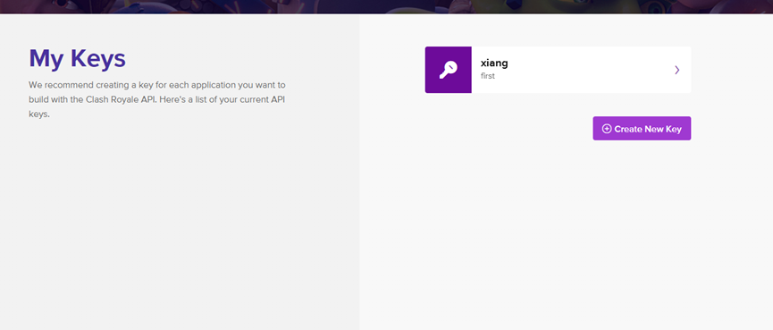
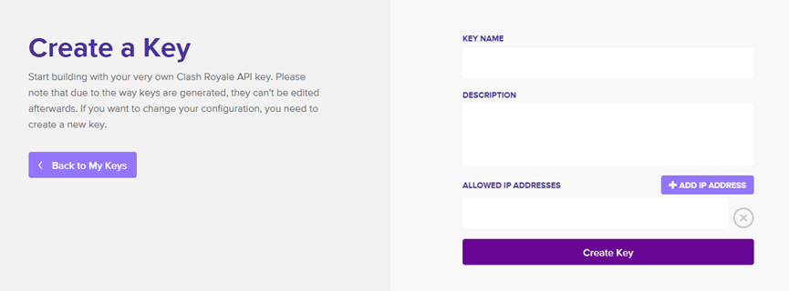

#### 登入 ClashRoyaleAPI

[點擊登入](https://developer.clashroyale.com/#/) 完成後點擊我的帳戶

---

#### My Keys

點擊創建新的Key

填入所需的資料
- KEY NAME : 你想取的名字
- DESCRIPTION : 介紹
- ALLOWED IP ADDRESSES : 填入的IP地址

按下 "Create Key" 即可得到你的 "TOKEN" 也就是 API KEY

----

 [相關應用請見](https://xiang511.com/TCRS/source/Open-Source.html) 